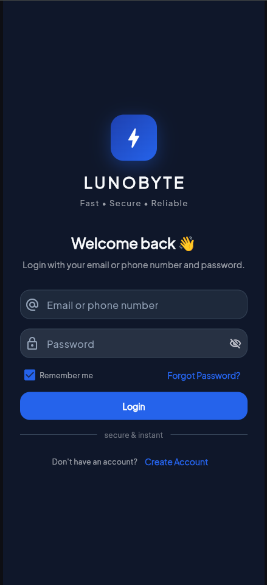

# VTU App — Airtime, Data & Cable Reselling Platform

<div align="center">


**Wallet-based VTU reselling platform — airtime top-up, data bundles, cable TV. Next.js web + Flutter mobile monorepo.**

</div>

---

## Screenshot



---

## Features

- Wallet funding via Paystack
- Airtime top-up (all major Nigerian networks)
- Data bundle purchase
- Cable TV subscription (DStv, GOtv, Startimes)
- Transaction history and wallet balance
- User authentication (web + mobile)
- Admin dashboard for monitoring transactions
- Flutter mobile client sharing the same backend API

## Tech Stack

| Layer | Technology |
|---|---|
| **Web Frontend** | Next.js 14, TypeScript, Tailwind CSS |
| **Mobile** | Flutter, Dart |
| **Backend API** | Node.js, PostgreSQL |
| **Payments** | Paystack |
| **Auth** | JWT |
| **Monorepo** | Shared API between web and mobile |

## Project Structure

```
vtu-app/
├── web/          # Next.js web application
├── mobile/       # Flutter mobile app
├── api/          # Shared backend API (Node.js)
└── shared/       # Shared types and utilities
```

## Quick Start

```bash
git clone https://github.com/Abdurrahman775/vtu-app.git
cd vtu-app

# Web
cd web && npm install && npm run dev

# Mobile
cd mobile && flutter pub get && flutter run

# API
cd api && npm install && npm run dev
```

## License

This project is licensed under the [MIT License](LICENSE).

---

**Abdurrahman Alhassan** · [Portfolio](https://abdurrahman775.vercel.app) · [GitHub](https://github.com/Abdurrahman775)
